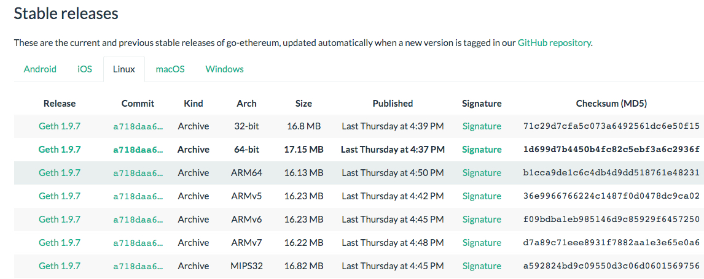

# geth安装与启动手册

## 1. 安装

### 1.1 for mac 

```
brew update
brew upgrade
brew tap ethereum/ethereum
brew install ethereum
```

### 1.2 for ubuntu 

- 命令行安装

```
sudo apt-get install software-properties-common
sudo add-apt-repository -y ppa:ethereum/ethereum
sudo apt-get update
sudo apt-get install ethereum
```

- 安装文件安装

[以太坊客户端下载地址](https://geth.ethereum.org/downloads/)



下载

```sh
wget https://gethstore.blob.core.windows.net/builds/geth-alltools-linux-amd64-1.9.6-bd059680.tar.gz
```
解压缩
```sh
tar zxvf https://gethstore.blob.core.windows.net/builds/geth-alltools-linux-amd64-1.9.6-bd059680.tar.gz
```
配置环境变量
```sh
mv geth-alltools-linux-amd64-1.9.6-bd059680 ~/geth-home
export PATH=$HOME/geth-home:$PATH
echo `export PATH=$HOME/geth-home:$PATH` >> ~/.bashrc
```


## 2. 启动

### 2.1 普通模式启动

#### 第一步：初始化
```sh
geth init genesis.json --datadir ./data
```

#### 第二步：启动
```
geth --datadir ./data --networkid 18 --port 30303 --rpc --rpcaddr 0.0.0.0 --rpcvhosts "*"  --rpcport 8545 --rpcapi 'db,net,eth,web3,personal' --rpccorsdomain '*' --allow-insecure-unlock  console 2> 1.log
```


### 2.2 开发者模式启动

```
geth --datadir ./devdata --networkid 18 --port 30303 --rpc --rpcaddr 0.0.0.0 --rpcvhosts "*"  --rpcport 8545 --rpcapi 'db,net,eth,web3,personal' --rpccorsdomain '*'  --dev --dev.period 1 console 2> 1.log
```
