## Metamsk安装

metamask是一款网页插件版的钱包，https://metamask.io/ 可以查看到它支持的浏览器。目前可以在chrome、360浏览器、firefox等浏览器上安装，由于安装chrome需要翻墙，因此本文介绍如何在360浏览器上安装该钱包插件。

步骤1：在浏览器右上角找到管理菜单，在其中点击【添加】

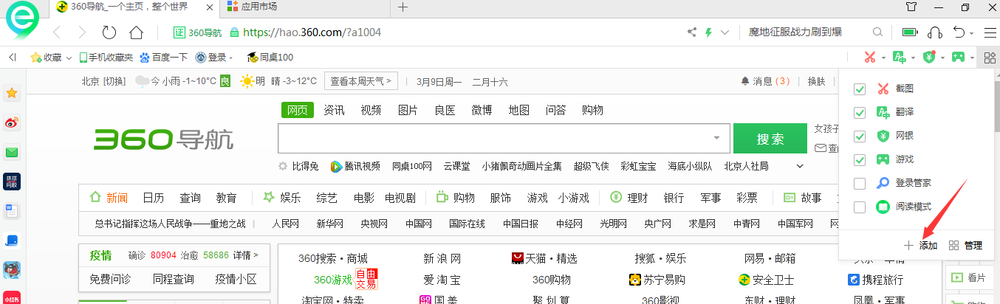

步骤2：在搜索框输入：metamask，点击【搜索】，将会看到小狐狸的图标，点击【安装】

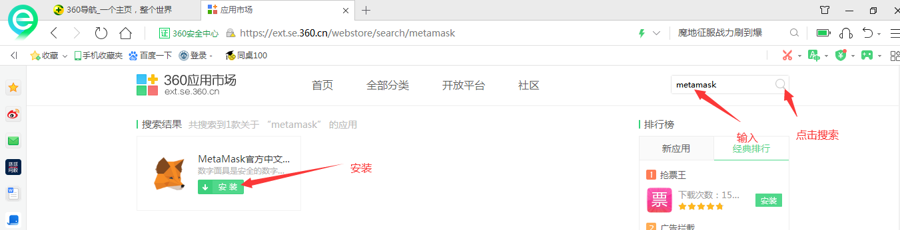

步骤3：安装后，会有提问是否要添加metamask，点击【添加】

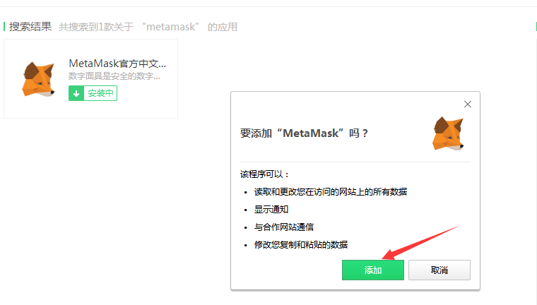

步骤4：安装完成后，右上角会有小狐狸图标，点击【开始使用】

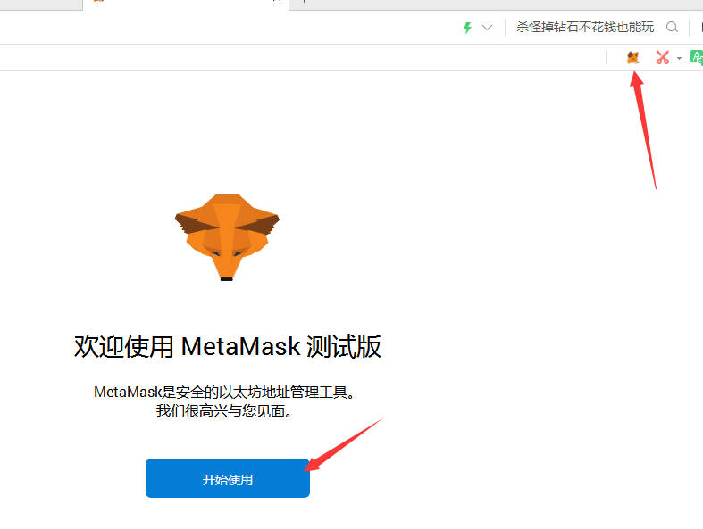

步骤5：点击【创建钱包】

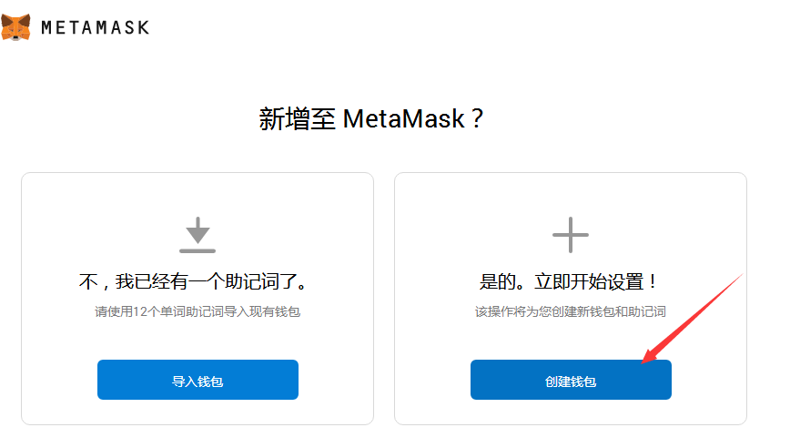

步骤6：点击【我同意】

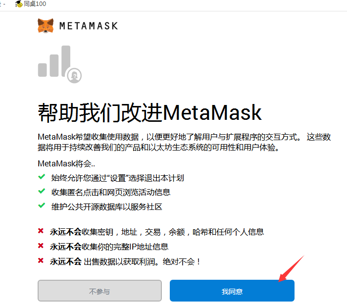

步骤7：输入密码，并勾选【我已阅读并同意】，点击【创建】

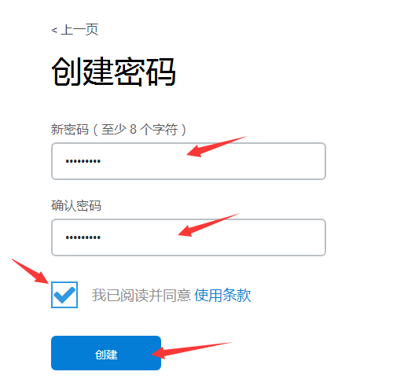

步骤8：点击【点击此处显示密语】

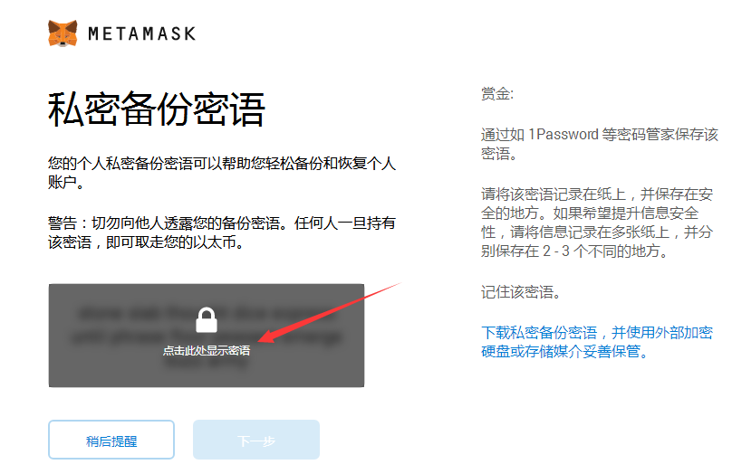

步骤9：注意要抄一遍助记词，点击【下一步】

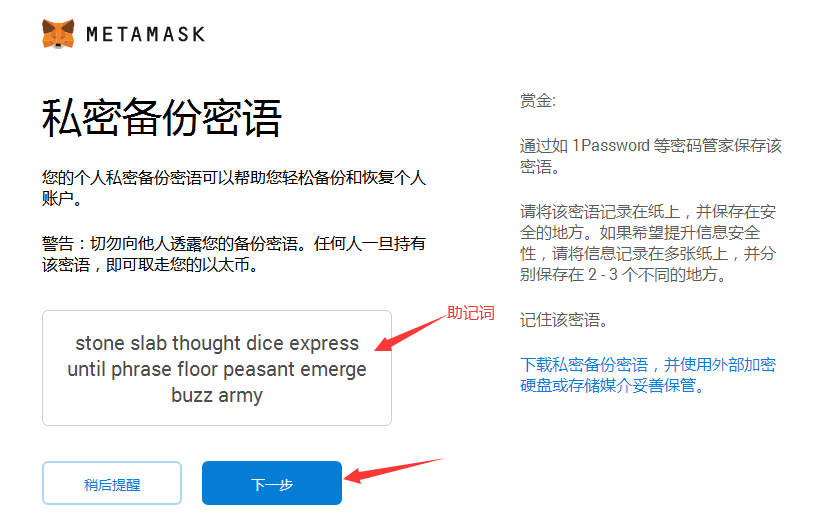

步骤10：助记词验证一

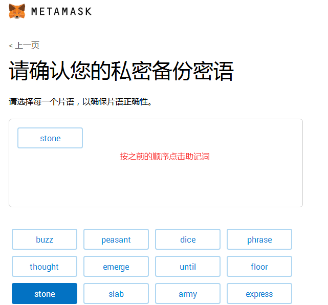

步骤11：助记词验证二

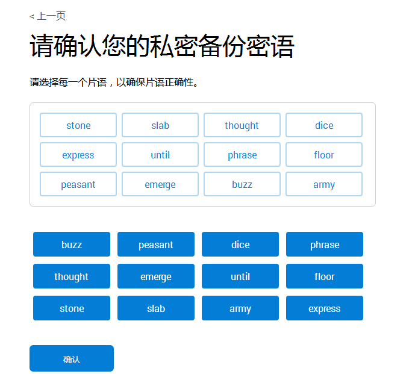

步骤12：钱包创建完成

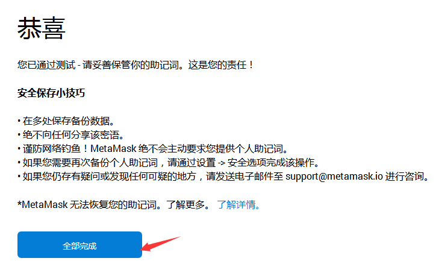

步骤13：主界面

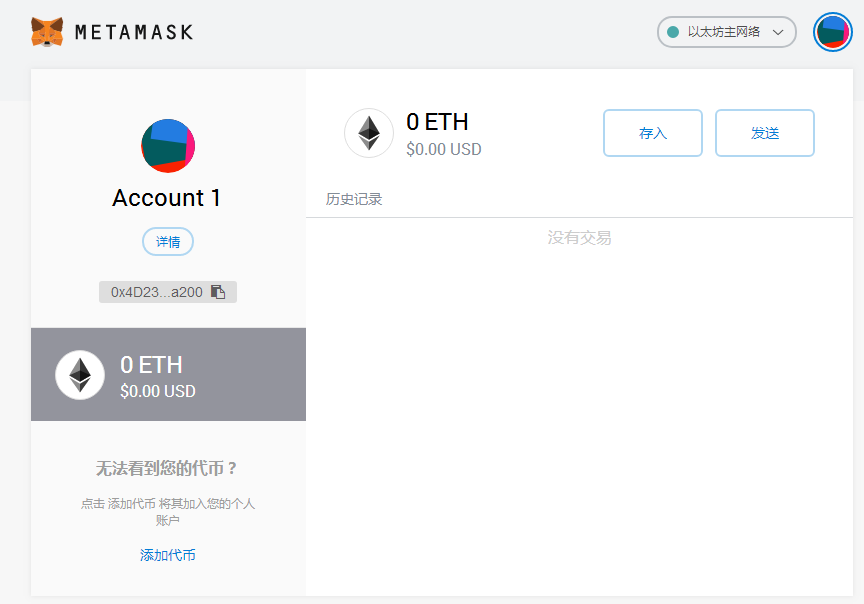

步骤13：切换到测试网

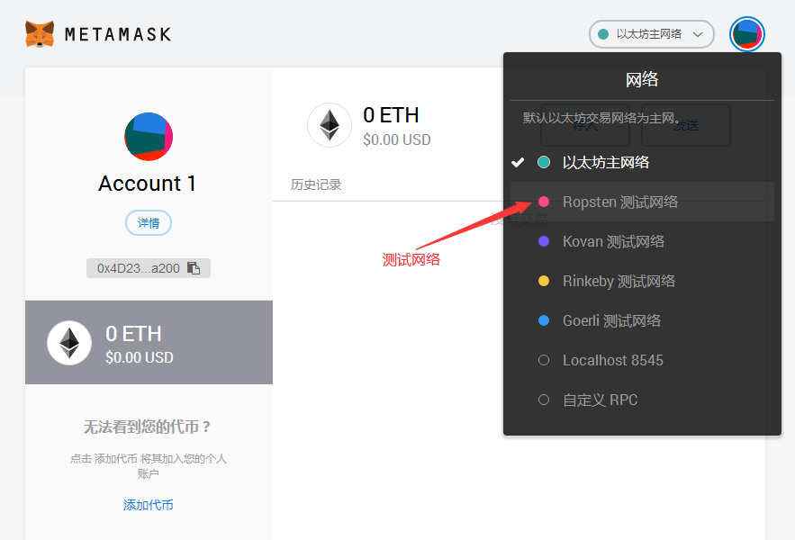

步骤14：存入ether

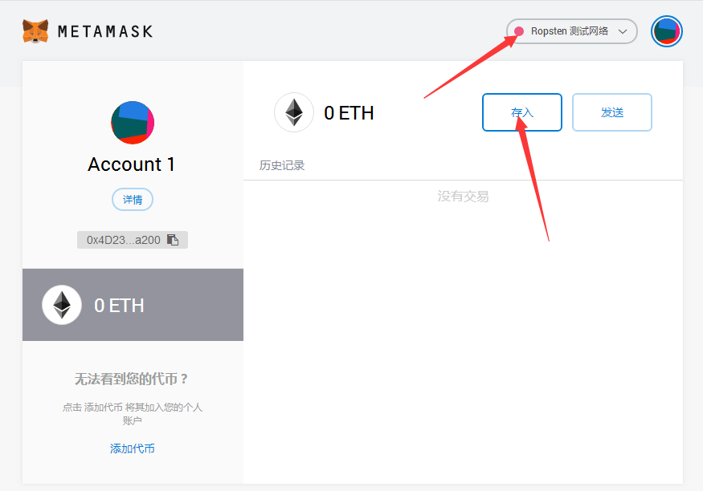

步骤15：点击【获得 Ether】

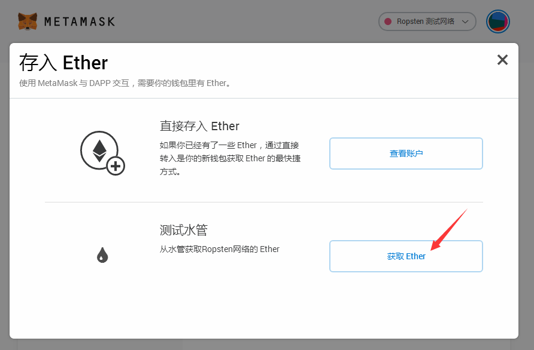

步骤16：点击绿色按钮，申请ether

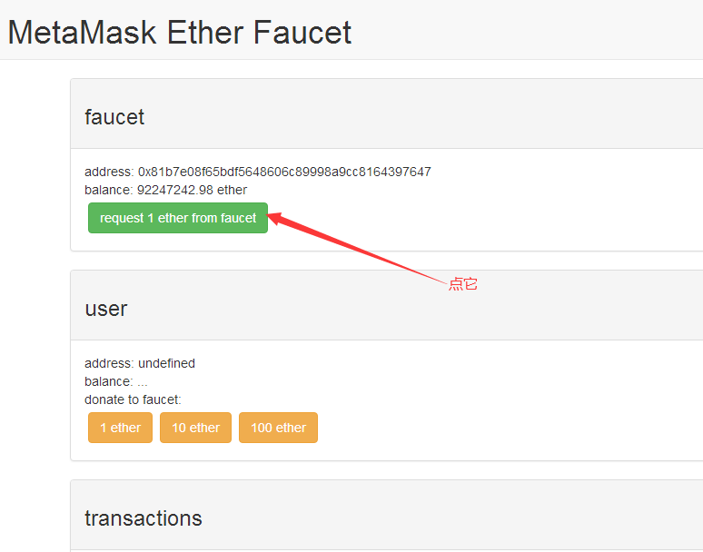

步骤17：刷新钱包页面，需要再次连接

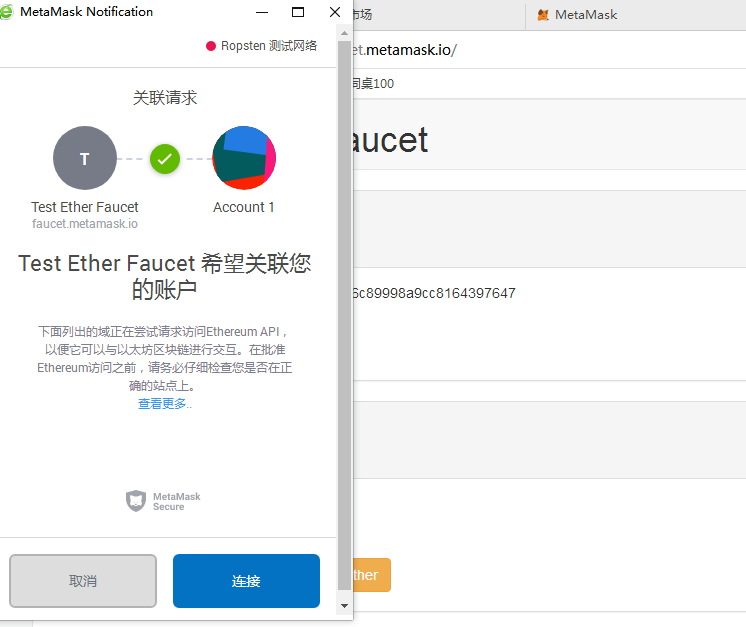

步骤18：可以看到账户内多了一个ETH

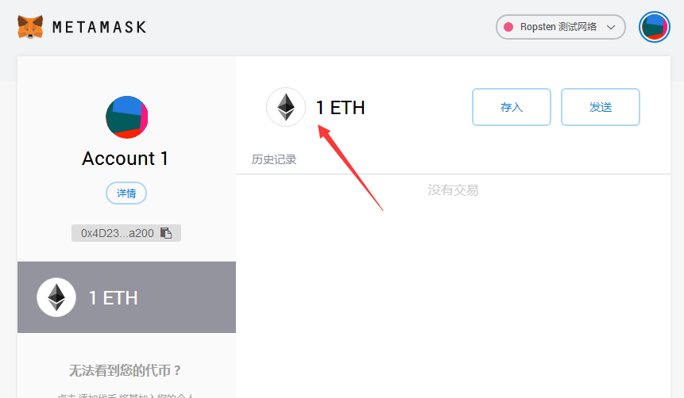

注意，此次申请的eth为测试网络中的eth，并不具备实际价值，开发者可以用来测试自己的智能合约。

